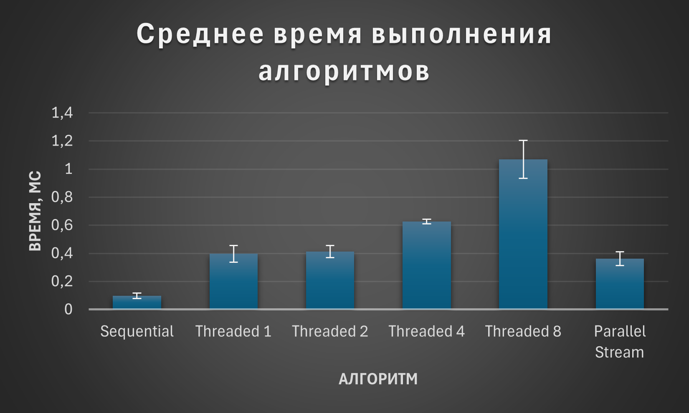
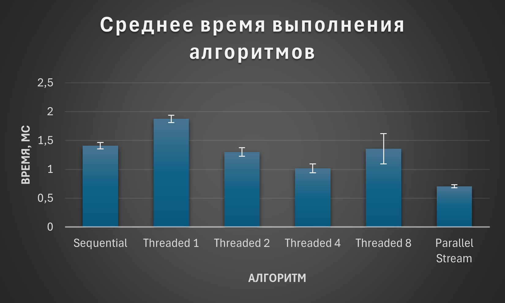
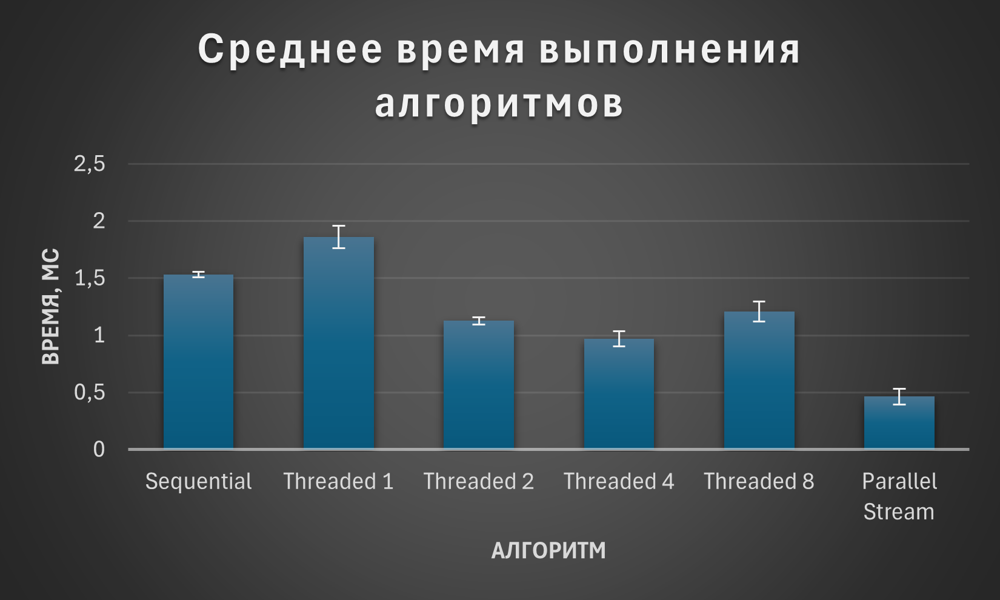
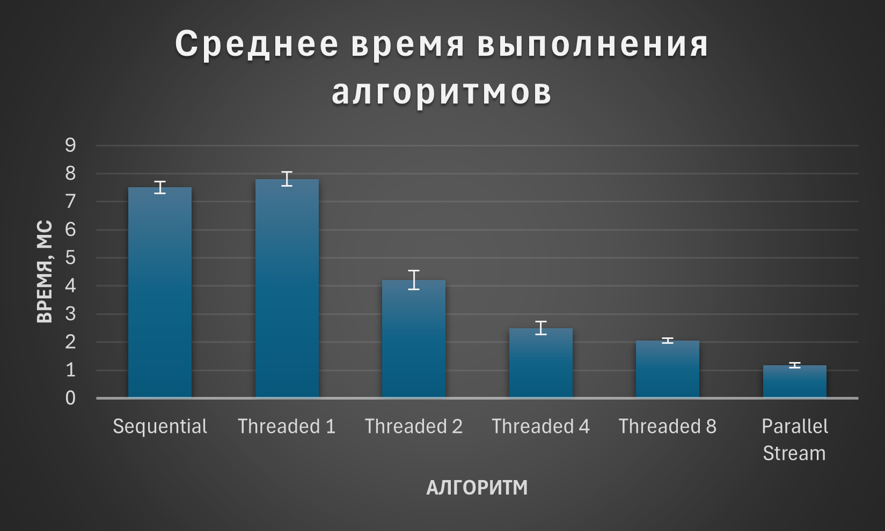

# Task_2_1_1

## Задача

В данной задаче реализованы 3 алгоритма поиска составного числа в массиве целых чисел.

Алгоритм получает на вход массив чисел и возвращает:
- `true`, если в массиве найдено хотя бы одно непростое число
- `false`, если все числа в массиве простые

Реализованы следующие варианты решения:
- `seq` - последовательный алгоритм в 1 поток
- `thread` - параллельный алгоритм с использованием `java.lang.Thread`
- `stream` - параллельный алгоритм с использованием `parallelStream`

## Исследование скорости поиска

Для сравнения производительности были подготовлены 4 набора входных данных:
1. `small_small` - массив длины `300`, состоящий из небольших простых чисел до `100000`
2. `large_small` - массив длины `5000`, состоящий из небольших простых чисел до `100000`
3. `small_large` - массив длины `300`, состоящий из больших простых чисел размером около нескольких миллионов
4. `large_large` - массив длины `1500`, состоящий из больших простых чисел размером около нескольких миллионов

Для многопоточной версии использовались фиксированные конфигурации:
- `1` поток
- `2` потока
- `4` потока
- `8` потоков

Для `parallelStream` использовалась конфигурация с параллелизмом `8`.

## Исследование

Для каждого набора данных выполнялось:
- `2` прогревочных запуска
- `5` измерений времени выполнения

По результатам измерений вычислялись:
- среднее время выполнения `avg`
- минимальное и максимальное время
- `90%` доверительный интервал
- коэффициент ускорения относительно последовательной версии

Результаты измерений сохраняются в папку `benchamrk_results`. Сырые результаты измерений сохраняются в `csv` файлы, а итоговая статистика записывается в `benchmark_report.txt`.

## Результаты исследования

Ниже приведены графики среднего времени выполнения алгоритмов для каждого сценария.  
По оси `Y` отложено время выполнения в миллисекундах и `90%` доверительный интервал.  
По оси `X` отложены алгоритмы: последовательный, параллельный с разным числом потоков и `parallelStream`.

### small_small

### large_small

### small_large

### large_large

## Вывод

Результаты показывают, что на маленьких входных данных последовательная реализация работает быстрее, так как накладные расходы на создание и координацию потоков превышают выигрыш от параллельного выполнения.

На более тяжёлых сценариях параллельные версии начинают выигрывать у последовательной. Наиболее заметное ускорение наблюдается для набора `large_large`, где проверка каждого числа требует больше вычислений, поэтому затраты на распараллеливание окупаются лучше.
