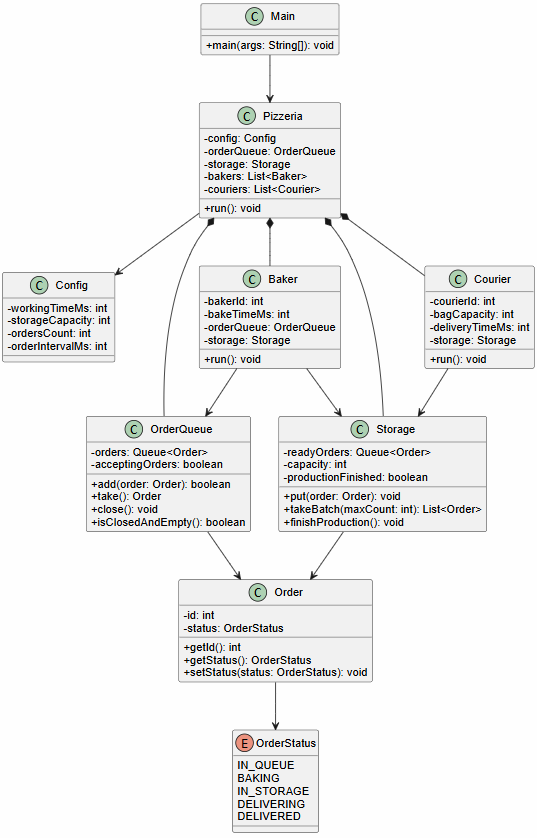

# Task_2_2_1

## Задача

В данной задаче реализован многопоточный симулятор работы пиццерии

В пиццерии есть:
- `bakers` - пекари с разной скоростью готовки
- `couriers` - курьеры с разной вместимостью сумки
- `storage` - склад готовой продукции с ограниченной вместимостью
- `orderQueue` - общая очередь заказов

Параметры пиццерии задаются в JSON-файле

## Схема работы

Заказ поступает в общую очередь и получает состояние `IN_QUEUE`

Свободный пекарь берёт заказ из очереди, переводит его в состояние `BAKING`,
готовит пиццу и кладёт её на склад. После этого заказ получает состояние `IN_STORAGE`

Курьер забирает со склада одну или несколько пицц, но не больше вместимости своей сумки. 
После этого заказ получает состояние `DELIVERING`, а после доставки - `DELIVERED`

При каждом изменении состояния программа выводит сообщение:

```text
[номер заказа] [состояние]
```

## Завершение работы

В проекте выбран вариант завершения: приостановка приёма заказов с завершением всех оставшихся

После окончания рабочего времени новые заказы больше не принимаются, 
но все уже поступившие заказы обрабатываются до конца. Пекари допекают заказы из очереди,
курьеры доставляют все заказы со склада, после чего потоки завершаются

## Диаграмма классов



## Синхронизация

Готовые потокобезопасные структуры данных не используются

Очередь заказов и склад реализованы самостоятельно на основе обычных коллекций и механизмов:
- `synchronized`
- `wait()`
- `notifyAll()`

Пекарь ожидает, если очередь пуста или склад заполнен. Курьер ожидает, если склад пуст

## Конфигурация

Пример `config.json`:

```json
{
  "workingTimeMs": 10000,
  "storageCapacity": 5,
  "ordersCount": 20,
  "orderIntervalMs": 300,
  "bakers": [
    { "id": 1, "bakeTimeMs": 1200 },
    { "id": 2, "bakeTimeMs": 1800 }
  ],
  "couriers": [
    { "id": 1, "bagCapacity": 2, "deliveryTimeMs": 2000 },
    { "id": 2, "bagCapacity": 3, "deliveryTimeMs": 2500 }
  ]
}
```


## SOLID

В проекте лучше всего выражен принцип единственной ответственности

`Order` хранит данные заказа, `OrderQueue` отвечает за очередь, `Storage` - за склад, 
`Baker` - за приготовление, `Courier` - за доставку, `Config` - за параметры, 
а `Pizzeria` координирует работу системы

Также частично соблюдается принцип открытости/закрытости: параметры пекарей, курьеров, 
склада и времени работы можно менять через JSON без изменения основной логики программы

## Вывод

Проект моделирует работу пиццерии с несколькими пекарями и курьерами

Основной акцент сделан на ручной синхронизации потоков 
без использования готовых потокобезопасных структур данных
